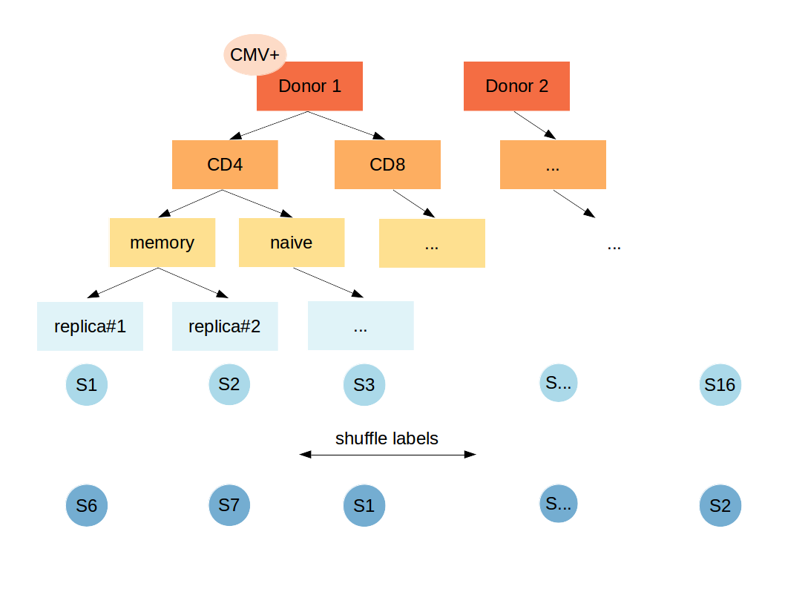

[](https://creativecommons.org/licenses/by-sa/4.0/)

# Immune repertoire annotation: a RepSeq data analysis tutorial


## Introduction

This tutorial covers some basic aspects of Immune Repertoire Sequencing (RepSeq) data analysis focused on T-cell receptor (TCR) repertoires:

* Repertoire diversity analysis

* Segment usage analysis

* Repertoire overlap analysis

* Annotation of antigen-specific TCR sequences

The main idea of this tutorial is to demonstrate the immense amount of information encoded in immune repertoires and the ability to
decode relevant characteristics from the RepSeq data using relatively simple bioinformatic/data mining methods.

Given a set of unlabeled samples from different donors (generated as shown below), T-cell subpopulations and phenotypes, we can reliably infer the
sample origin and even some properties of the immunological status of a (relatively) healthy donor.



This analysis uses 16 samples of 10,000 random reads from two donors from [Qi et al. PNAS 2014](http://www.pnas.org/content/111/36/13139.short) study (sample labels and TCR nucleotide sequences are removed).

## Pre-requisites / setup

This tutorial should run fine on both Mac, Linux and Windows. The setup is the following:

1. Install **RStudio** which can be downloaded from [https://www.rstudio.com](https://www.rstudio.com)

2. Execute the following code in RStudio console to install the required R packages:

```{r}
install.packages(c("data.table","dplyr","reshape2","ggplot2","NMF","scales","forcats","parallel","stringr"))
```

You can also install these packages manually from the **Tools -> Install packages..** menu.

> N.B. As the tutorial relies on widely used R packages, if you encounter any problems during installation
the best option for you would be to google (or check StackOverflow) for the error message and try to fix it on your own.
> For example most problems with Mac are solved by installing the missing Xcode software.

3. Get yourself familiar with RStudio/R markdown by watching this [video](https://www.youtube.com/watch?v=TJmNvfhLCoI).

4. Download the contents of this repository by clicking the **Clone or download** button (you can also use ``git clone``).

5. Navigate with the folder containing the tutorial, then open the ``tutorial.Rmd`` R markdown notebook.

After that, you can sequentially execute different parts of the analysis arriving to a set of basic RepSeq analysis results.

## Post-analysis

After obtaining the results summarizing all 16 samples you should be able to label them with the following categories:

1. Donor ID, ``first`` or ``second`` donor (the order doesn't matter)
2. Cell phenotype, ``memory`` or ``naive``
3. Cell subset, ``CD4`` or ``CD8``
4. Donor CMV status, ``cmv+`` or ``cmv-``
5. Donor HLA allele, in ``X*XX`` format (where applicable)

## Slides

The slides can be found [here](https://github.com/antigenomics/repseq-forensics-tutorial/blob/master/slides/slides.pdf).
